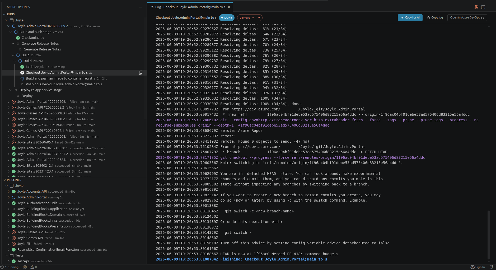
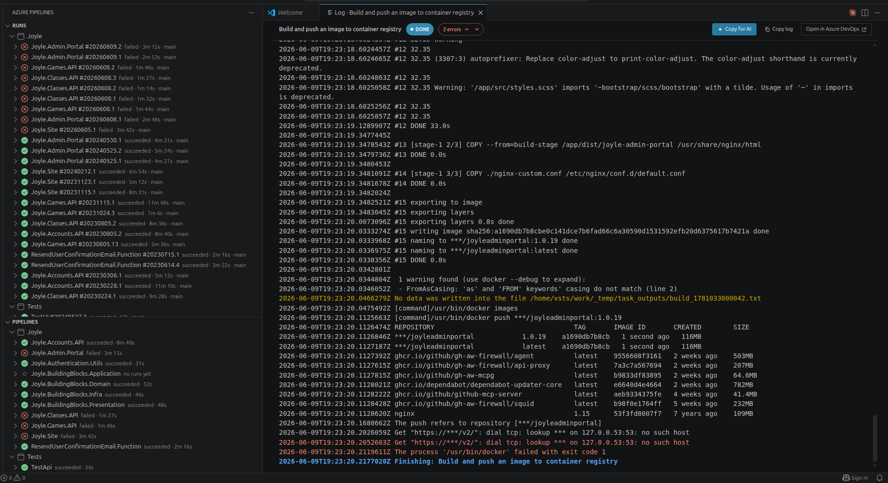

# Azure Pipelines Inbox

Monitor your Azure DevOps **pipeline runs live from VS Code's sidebar**, without switching to
the browser — the Stage → Job → Task timeline and logs update in real time, and a notification
tells you when a run finishes. When a build fails, jump straight to the first error and copy it,
trimmed and with context, into your AI assistant (Cursor, Copilot, Claude, ChatGPT) to fix.



## Features

- **Runs inbox** — a tree of recent runs per subscribed project, with status icons that update in place.
- **Live timeline** — expand a run to see its Stage → Job → Task tree; in-progress steps spin and flip to
  pass/fail as they finish.
- **Live log tail** — open the logs for any step in a rich panel that appends new lines while the step runs,
  with `##[error]` / `##[warning]` / `##[section]` highlighting.
- **Jump to first error** — on a failed run, one click (the 🐛 button or **View First Error**) opens the
  first failed step's log scrolled straight to the error.
- **Copy for AI** — copy a step's log straight into your AI chat (Cursor, Copilot, Claude, ChatGPT). It adds a
  short context header (pipeline, step, result, branch, link) and, for long logs, trims to the errors plus
  surrounding context so the important part fits the model's window. A plain **Copy log** is there too.
- **Pipelines view** — a second tree listing every pipeline in your subscribed projects, for browsing and
  running them directly (see **Run actions**).
- **Filters** — only my runs, status (all / succeeded / failed), and branch.
- **Run actions** — **Run** a pipeline (▶ on each pipeline in the Pipelines view, with a branch
  prompt), **cancel** an in-progress run, **re-run** a whole pipeline, or **re-run just the failed jobs**
  of a failed run. The first time you use one, it walks you through a one-time write-token setup; until
  then your sign-in stays read-only.

It polls only while something is in progress, then goes idle. Finished runs surface as a desktop
notification (configurable via `notifyOnComplete`) and a `▶ N running` / `✖ N failed` status-bar summary
that jumps you back to the inbox.



*The log panel tailing a step — error/warning highlighting, with **Copy for AI** and **Copy log** in the header.*

## Install

Search **Azure Pipelines Inbox** in the Extensions view. It's published to both the
[VS Code Marketplace](https://marketplace.visualstudio.com/items?itemName=danilocolombi.azure-pipelines-inbox)
and [Open VSX](https://open-vsx.org/extension/danilocolombi/azure-pipelines-inbox), so it installs in
VS Code as well as Cursor, VSCodium, and Windsurf.

## Getting started

1. Run **Azure Pipelines: Sign In** and enter your organization URL (e.g. `https://dev.azure.com/contoso`)
   and a Personal Access Token with **Build (Read)** and **Project and Team (Read)** scopes.
2. Run **Azure Pipelines: Manage Subscriptions** and pick the projects whose pipelines you want to see.
3. Expand a run to watch its timeline; click a step (or use **View Logs**) to tail its log.

## Settings

| Setting | Default | Description |
| --- | --- | --- |
| `azurePipelines.organizationUrl` | `""` | Azure DevOps organization URL. |
| `azurePipelines.subscriptions` | `[]` | Subscribed projects (managed via Manage Subscriptions). |
| `azurePipelines.onlyMyRuns` | `false` | Only show runs you triggered. |
| `azurePipelines.statusFilter` | `all` | `all` / `succeeded` / `failed`. |
| `azurePipelines.branchFilter` | `""` | Only show runs for this branch. |
| `azurePipelines.runsTop` | `25` | Max runs listed per project. |
| `azurePipelines.pollSeconds` | `4` | Poll interval (seconds) for in-progress runs and tailing logs. |
| `azurePipelines.notifyOnComplete` | `mine` | Notify when a tracked run finishes: `off` / `mine` / `all`. |
| `azurePipelines.enableActions` | `false` | Enable Cancel / Re-run (prompts for a Build Read & Execute PAT). |

## Run actions (run / cancel / re-run)

The action buttons are always visible, but the extension stays **read-only by default**: the first time
you trigger one, it asks for a Personal Access Token with **Build (Read & Execute)** (a one-time setup —
this token is a superset of read, so your existing read features keep working). Cancel out and nothing
changes. You can also do this up front via **Azure Pipelines: Enable Run Actions**.

The actions:

- **Run Pipeline** — the ▶ button on each pipeline in the Pipelines view; prompts for a branch (leave it
  empty to run the pipeline's default branch).
- **Cancel Run** — on an in-progress run.
- **Re-run Pipeline** — queues a fresh run of the whole pipeline.
- **Re-run Failed Jobs** — on a failed run; retries only the failed stages in place (the same run goes
  back to in-progress), like the Azure DevOps web UI's "Rerun failed jobs". Pipelines without stages
  (classic builds) fall back to a full re-run.

## How "live" works

Azure DevOps has no public push API; its own web UI builds the live view by polling. This extension
does the same via `azure-devops-node-api`: it polls the **build timeline** to update the step tree and
re-reads the active step's **log lines** from an advancing offset to append output. Polling runs only
while a run is in progress.

## Development

```sh
npm install
npm run build      # esbuild bundle → dist/extension.js
npm run watch      # rebuild on change (for F5)
npm run compile    # tsc --noEmit type-check
npm run lint
```

Press **F5** to launch the Extension Development Host.

The Marketplace icon (`media/icon.png`) is generated from `scripts/gen-icon.js` — run
`node scripts/gen-icon.js` to regenerate it after tweaking the design.

## More from this author

- **[Azure Boards Inbox](https://marketplace.visualstudio.com/items?itemName=danilocolombi.azure-boards-inbox)**
  — a focused sidebar inbox for your assigned work items, pull requests, and comments, organized by project
  with live counts and one-click actions.
